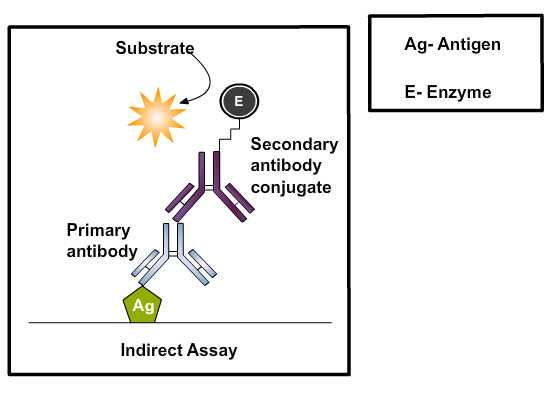

### Principle:

 

The Indirect-ELISA utilizes an unlabeled primary antibody in conjunction with a labele secondary antibody. Since the labeled secondary antibody is directed against all antibodies of a given species, it can be used with a wide variety of primary antibodies.

 

 
### Different Stages Of Indirect ELISA:

 
### Coating ELISA Plates :

 

Coating is achieved through passive adsorption of the antigen to the assay microplate. This process occurs though hydrophobic interactions between the micro titer plate and non-polar protein residues. Although individual proteins may require specific conditions or pretreatment for optimal binding, the most common method for coating plates involves adding a 2-10 μg/ml solution of protein dissolved in an alkaline buffer such as phosphate-buffered saline (ph 7.4) or carbonate-bicarbonate buffer (ph 9.4).The buffer contains no other proteins that might compete with the target antigen for attachment to the micro titer plate. Antigens ,which are protein in nature will attach passively to the micro titer well plate during incubation in incubator at 370C.

 
### Washing step:

 

After incubation any excess antigen is removed by washing steps by flooding and emptying the wells with neutral phosphate buffered saline ( PBS ) or deionized water. Washing steps are necessary to remove nonbound reagents and decrease background, thereby increasing the signal: noise ratio. Insufficient washing will allow high background, while excessive washing might result in decreased sensitivity caused by elution of the antigen from the well.

 
### Add blocking buffer :

 

The binding capacity of microplate wells is typically higher than the amount of protein coated in each well and the  residual binding capacity of the plate is blocked in this step. The ideal blocking buffer will bind to all potential sites of nonspecific interaction, eliminating background altogether, without altering or obscuring the epitope for antibody binding. The blocking buffer is effective if it improves the sensitivity of an assay by reducing background signal and improving the signal-to-noise ratio. Tween 20 (0.05%) by itself is more effective at blocking than any protein tested, but because the combination of protein and Tween 20 may be more effective  than Tween 20 alone  in some cases, bovine serum albumin (BSA; 0.25%) is included in the blocking buffer. Coated plates can be used immediately or dried and stored at 4°C for later use, depending on the stability of the coated protein.

 
### Add primary antibody :

 

This step involves the addition of detecting antibodies     (test sample) being  directed against the coated antigen. The antibody is usually diluted in blocking buffer to prevent non specific attachment of protein in the antiserum on the solid phase. The antibody present in the serum which are specific to the antigen, binds the coated antigen on incubation.

 
### Washing step : 

 

Excess antibody or unbound antibodies are removed by washing step and is followed by addition of blocking solution.

 
### Add secondary antibody (antibody enzyme conjugate):

 

The next step is the addition of secondary antibody, diluted in blocking buffer directed against the primary antibody. Followed by incubation to the achieve the binding of the enzyme-conjugated secondary antibody. The choice of antibody enzyme  conjugate is determined by the goals of the assay. If it is necessary to detect all antibodies that bind to antigen, conjugates prepared with antibodies specific for Ig κ and λ light chains should be used. Alternatively, protein A or protein G–enzyme conjugates may  be  preferable  when  screening monoclonal  antibodies. Such antibodies are produced against immunoglobulins (Ig’s) of species in which the detecting antibodies are produced and are termed anti-species conjugates. Thus, if detecting antibodies are produced in rabbits, the enzyme-labeled antibodies would have to be anti-rabbit Ig’s in nature. This allow greater flexibility in use of anti-species conjugates in that different specificities of conjugate can be used to detect particular Ig’s binding in the assay. For example, the anti-species conjugate could be anti- IgM, igg1, igg2 and  so on. The  enzyme can be linked to a protein such as streptavidin  if the primary antibody is biotin labeled. The most commonly used enzyme labels  horseradish peroxidase (HRP) and alkaline phosphatase (AP). Other enzymes have been used as well, but they have not gained widespread acceptance because of limited substrate options. These include β-galactosidase, acetylcholinesterase and catalase.

 
### Washing step:

 

Unbound antibody enzyme conjugate is washed away after incubation phase.

 
### Adding substrate : 

 

Substrates are critical for the detection and visualization steps of an ELISA. The step involves the addition of suitable substrate solution for the particular enzyme conjugated to the antibodies. The objective is to allow development of color reaction  through enzyme catalysis. A large selection of substrates is available for performing the ELISA with an HRP or AP conjugate. TMB (3, 3’, 5, 5’-tetramethyl benzidine) is the most commonly used substrate for the enzyme horseradish peroxidase (HRP).The  substrates  of  alkaline  phosphatase (AP) , 4-methylumbelliferyl phosphate  (MUP)  and  PNPP (p-Nitro phenyl-phosphate)  are  nontoxic and  relatively  stable.  Solutions  of  p-nitro-phenyl phosphate (NPP) are stable for months at 4°C, while solutions of 4-methylumbelliferyl phosphate  (MUP)  can  be  kept  for months  at room  temperature  without  any  significant spontaneous hydrolysis. The biggest disadvantage if NPP  is used  as  a  substrate is that,  the  yellow  color  of  the nitro phenyl  product  is  relatively  difficult  to detect  visually. Using  the  substrate MUP  instead of NPP can greatly enhance the sensitivity of  the  assay.  The  fluorogenic  system  using MUP is 10 to 100 times faster than the chromogenic system using NPP, and appears to be as sensitive as an enhanced chromogenic assay in which  alkaline  phosphatase  generates NAD+ from NADP. The disadvantage of using fluorogenic substrates is that they require a microplate fluorometer costing twice as much as a high quality micro titer plate spectrophotometer.

 

The choice of substrate depends upon the required assay sensitivity and the instrumentation available for signal-detection (spectrophotometer, fluorometer or luminometer).

 
### Stop solution :

 

The reaction is allowed to progress for a defined period after which the reaction is stopped by altering the ph of the system. Stop Solution is a used to terminate the enzyme substrate reaction for ELISA applications after attaining the desired color  intensity which is an indication of analyte level. For e.g. The TMB substrate reacts with immobilized horseradish peroxidase (HRP) conjugated secondary antibodies to produce a blue solution. Reaction may be stopped by 0.2 M sulphuric acid which offers a yellow end product read at 450 nm. AP stop solution (0.5M NaOH) does not change the yellow color or the absorbance of the chromogen, and so the absorbance is read at 405 nm to 420 nm.

 
### Quantification:

 

Specially designed spectrophotometers are available which reads through the micro titer wells either singly or in rows. Several ELISA plate readers are available, with increasing levels of sophistication. Some of these provide a measurement of optical density while some tabulate data and apply statistical analysis. Compatibility with a small computer, and availability of a suitable program to process the results and transform the optical density readings into concentrations of protein are important additional things to look for when selecting an instrument. Most ELISA readers can be set to measure the absorbance of the colors produced by the action of antibody- conjugated enzymes on their respective substrates the microplate reader works by shining a particular type of  light at each of the samples in the micro well plate. Common detection modes for microplate assays are absorbance, fluorescence intensity, luminescence, time-resolved fluorescence and fluorescence polarization. A light source illuminates the sample using a specific wavelength (selected by an optical filter, or a monochromator), and a light detector located on the other side of the well measures how much of the initial (100%) light is transmitted through the sample, the amount of transmitted light will typically be related to the concentration of the molecule of interest. This is called absorption detection. The range of application of fluorescence intensity  detection is much broader than when using absorbance detection, but instrumentation is usually more expensive.  Microplate readers feed the absorbance or fluorescence measures into a computer program that analyses the particular information being collected.

 
### Assay optimization :

 

Serial dilution titration analyses are performed to determine optimal concentrations of reagents to be used in Elisa’s. All three reactants in ELISA, a solid-phase coating reagent, a secondary reagent that binds the primary reagent, and an enzyme-conjugated tertiary developing reagent that binds to the secondary reagent are serially diluted and analyzed by a criss-cross matrix analysis. Once the optimal concentrations of reagents to be used under particular assay conditions are determined, these variables are kept constant from experiment to experiment.

 
### Assay validation :

 

ELISA kits that are commercially available which are used for diagnostic purposes in  the detection of specific antigen or antibody in the serum sample. For e.g.,ovarian cancer antigen (CA-125) enzyme immunoassay test  kit  is intended for use as a monitoring and screening test for  serum CA-125 level. An elevated serum CA-125 level can indicate ovarian cancer and suggests the need for further clinical management, also determining  serum CA-125 concentration may be useful in monitoring patients with diagnosed ovarian cancer.

 

Materials provided with the test kits includes antibody coated micro titer plate with 96 wells, enzyme conjugate reagent, substrate solution, stop solution, wash buffer concentrate, sample diluents, reference standards, positive and negative controls.

 

ELISA results are reported as a number and the most controversial aspect of this test is determining the "cut-off" point between a positive and negative result. A cut-off point may be determined by comparing  the ELISA plate  reader value with a known reference standard.  If an ELISA test is used for drug screening at workplace, a cut-off concentration, 50 ng/ml, for example, is established, and a sample will be prepared which contains the standard concentration of analyte. Unknowns that generate a signal that is stronger than the known sample are "positive" and those that generate weaker signal are "negative."
